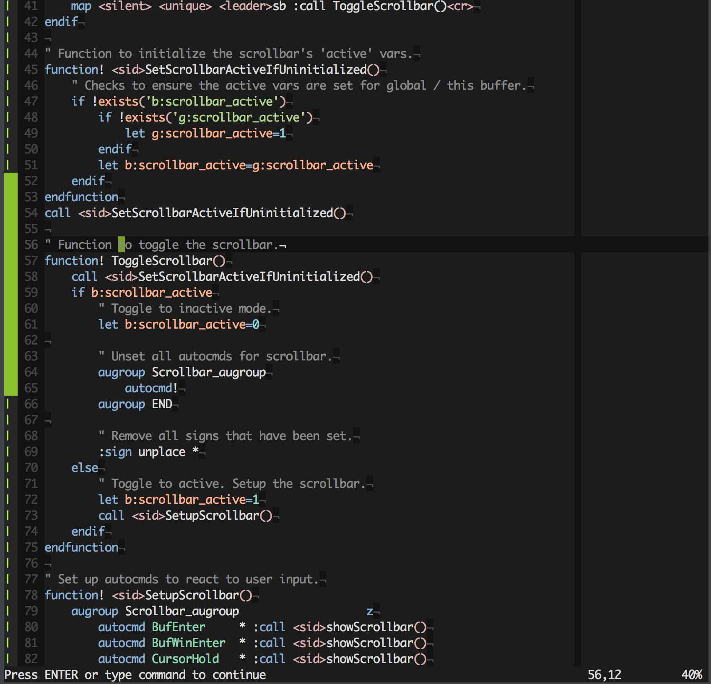

# vim-scrollbar

Displays a scrollbar with 'thumb' in curses-based vim (works in terminal).

Uses the 'sign' feature of vim to display a scrollbar on the left-hand side.

## Motivation

You may find that proportional scrollbars are useful in long bodies of text if you are trying to edit
a long file (as a wild example, a 5k SLOC python file at an old job). Trying to keep track of the "% of page" metric
might not cut it. You may also be adverse to opening gvim/macvim (e.g maybe you use i3 or another tiling window system
with a strong preference for staying in terminal windows).

## Settings

Starts out enabled when sourced, assuming you always want to see the scrollbar.
If you'd like to default to starting unsourced, add this to your `.vimrc:`

    " Prevents loading by telling the plugin it's already loaded. You'll have
    " to :call ToggleScrollbar()<CR> if you want to load it manually.
    let g:loaded_scrollbar=1

Default settings. These can be overridden by putting these in your `.vimrc`:

    " Default characters to use in the scrollbar.
    let g:scrollbar_thumb='#'
    let g:scrollbar_clear='|'

    " Color settings.
    highlight Scrollbar_Clear ctermfg=green ctermbg=black guifg=green guibg=black cterm=none
    highlight Scrollbar_Thumb ctermfg=darkgreen ctermbg=darkgreen guifg=darkgreen guibg=darkgreen cterm=reverse

Default mapping to toggle the scrollbar on/off is `<leader>sb`. If you're new to
vim, that means `\sb` (press those keys in that order). You can change this by
adding this line to your `.vimrc` and editing the mapping.

    map <leader>sb :call ToggleScrollbar()<cr>

## License

Distributed under the same terms as Vim itself. See `:help license`.

## Contributors

* Current Maintainer: Sam Liu <sam@ambushnetworks.com>
* Initial Author: Loni Nix <lornix@lornix.com>
